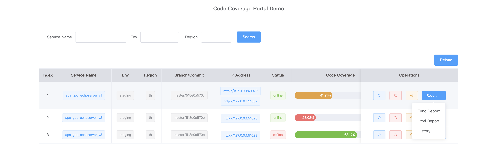
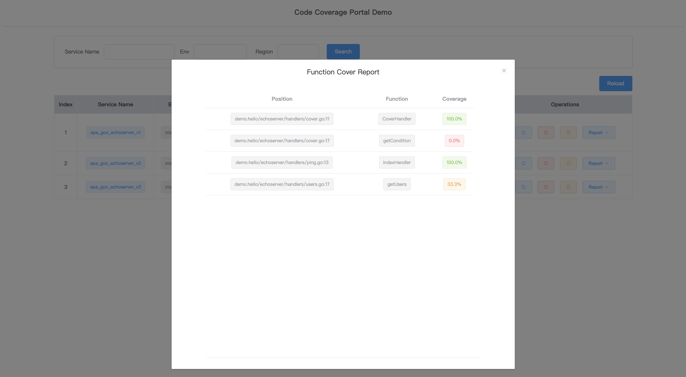
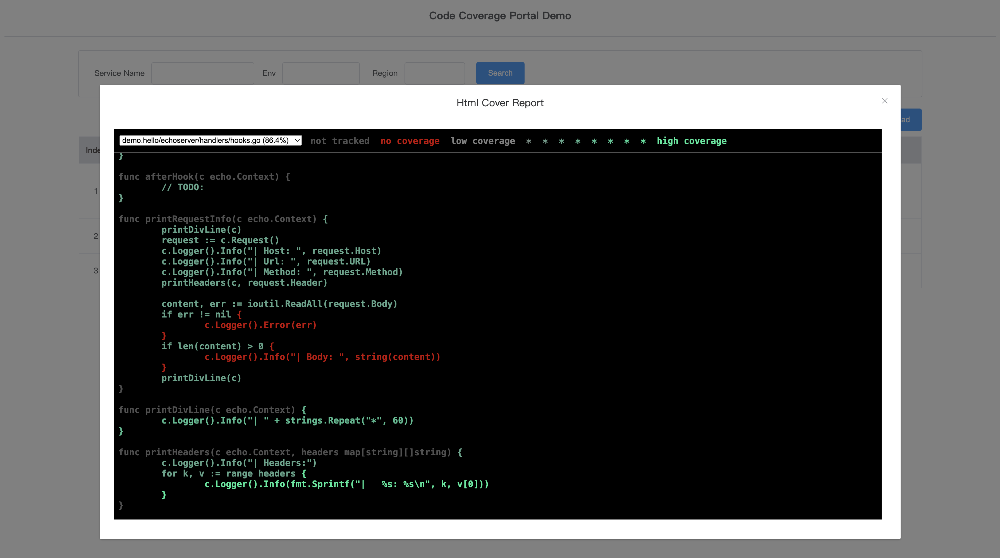

# Goc Plugin

## Overview

- Goc Plugin 包括 Goc Report, Goc Watch Dog 和 Goc Portal 3个部分
- 基于工具 Goc + diff_cover (二次开发)

### Goc Report

1. 从 goc server 获取指定服务的覆盖率数据
  - 一个服务的一个 commit 下，可能会包括 N 份覆盖率数据（1份最新数据+历史数据）
  - 如果服务已下线（异常退出），则从 goc watch dog 获取覆盖率数据
  - 支持服务多个副本的覆盖率数据合并

2. 生成覆盖率报告
  - func/html 覆盖率报告
  - 增量代码覆盖率报告

问题：

1. 拉取和生成覆盖率报告性能问题
  - 异步执行，指定时间内完成则返回结果，否则返回超时
  - 覆盖率结果缓存 N 分钟

### Goc Watch Dog

1. 定时从 goc server 中删除已下线的服务（pod）
  - 检查 goc attached server 端口（代替从 pod monitor 服务接口查询 pod 状态）

2. 定时拉取 goc server 中服务覆盖率数据

3. 服务异常退出前，拉取服务覆盖率数据
  - 提供回调接口，在 pod 中设置 pre-stop webhook

### Goc Portal

服务覆盖率结果展示：

- Cover total
- Func cover report
- Html cover report
- 增量覆盖率报告
- 历史覆盖率数据趋势图

操作：

- Refresh
- Force refresh
- Clear cover

#### Goc Portal Demo

- Cover report portal



- Func cover report



- Html cover report



------

## Goc Plugin Design

### 服务架构



### Goc Report 工作目录

工作目录（root dir）结构如下：

```text
- goc_report_root/
  - gocplugin.json
  - module_repo_map.json
  - sqlite.db
  - public/report/
    - module_x/
      - module_x_1_report.html
      - module_x_2_report.html
    - module_y/
      - module_y_1_report.html
  - module_x/
    - repo/
    - cov_data/
      - module_x_1.cov
      - module_x_1_report.txt
      - module_x_2.cov
      - module_x_2_report.txt
  - module_y/
    - repo/
    - cov_data/
      - module_y_1.cov
      - module_y_1_report.txt
```

### Goc Report Table

- `goc_o_staging_service_cover`

字段包括：`id,created_at,updated_at,deleted_at,env,region,app_name,addresses,git_branch,git_commit,is_latest,cov_file_path,cover_total`

使用 key `env + region + app_name + git_commit` 标识一个服务的覆盖率数据，有多条数据，但 `is_latest=y` 的数据只会有1条。

## Local Test Env Prepare

1. Build and start goc server

```sh
# build
cd goc/; go build .
# run
goc server
```

2. Build and start echoserver

```sh
# build
cd echoserver/; goc build . -o goc_echoserver --center="http://127.0.0.1:7777"
# run
ENV=staging APPTYPE=apa REGION=th GIT_BRANCH=origin/master GIT_COMMIT=b63d82705a ./echoserver_goc -p 8081
```

3. Check register services

```sh
goc list
# {
#  "staging_th_apa_goc_echoserver_master_518e0a570c":["http://127.0.0.1:49970","http://127.0.0.1:51007"],
#  "staging_th_apa_goc_echoserver_v2_master_518e0a570c":["http://127.0.0.1:51025"]
# }
```

4. Test echoserver api

```sh
curl -i http://localhost:8081/
curl -i http://localhost:8081/ping

curl -XPOST "http://localhost:8081/mirror?name=foo" -H "X-Test:Mirror" -d 'hello' | jq .
```

------

## Goc Rest API

- List register services in goc

```sh
curl http://localhost:7777/v1/cover/list | jq .
```

- Register service in goc center

```sh
curl -XPOST "http://localhost:7777//v1/cover/register?name=staging_th_apa_goc_echoserver_v1&address=http://127.0.0.1:49971"
```

- Get service coverage

```sh
curl -XPOST http://localhost:7777/v1/cover/profile -H "Content-Type:application/json" \
  -d '{"service":["staging_th_apa_echoserver_goc_master_b63d82705a"]}' -o apa_goc_echoserver.cov
```

- Remove service from goc list

```sh
curl -XPOST http://localhost:7777/v1/cover/remove -H "Content-Type:application/json" \
  -d '{"service":["staging_th_apa_goc_echoserver_v1"]}'
```

- Attached server api

```sh
curl http://127.0.0.1:51025/v1/cover/coverage
```

------

## Goc Report Rest API

Server health check:

```sh
curl -i http://127.0.0.1:8089/
curl http://127.0.0.1:8089/ping | jq .

curl -i http://127.0.0.1:8089/nonexist
```

### API Group: Cover Total

- `/cover/total/list`: get list of services cover info.

```sh
curl http://127.0.0.1:8089/cover/total/list | jq .
```

- `/cover/total/latest`: get latest service cover total.

```sh
curl -XPOST http://127.0.0.1:8089/cover/total/latest -H "Content-Type:application/json" \
  -d '{"srv_name":"staging_th_apa_echoserver_master_6cd6e61317"}' | jq .
```

- `/cover/total/history`: get history service cover totals.

```sh
curl -XPOST http://127.0.0.1:8089/cover/total/history -H "Content-Type:application/json" \
  -d '{"srv_name":"staging_th_apa_echoserver_master_6cd6e61317"}' | jq .
```

### API Group: Cover Operations

- `/cover/raw`: get service cover raw data from goc.

```sh
curl -XPOST http://127.0.0.1:8089/cover/report/raw -H "Content-Type:application/json" \
  -d '{"srv_name":"staging_th_apa_echoserver_master_6cd6e61317"}' -o 'raw_profile.cov'
```

- `/cover/sync`: sync service cover results from goc, generate report, and returns cover total.

```sh
curl -XPOST http://127.0.0.1:8089/cover/sync -H "Content-Type:application/json" \
  -d '{"srv_name":"staging_th_apa_echoserver_master_6cd6e61317"}' | jq .

# force sync
curl -XPOST http://127.0.0.1:8089/cover/sync -H "Content-Type:application/json" \
  -d '{"srv_name":"staging_th_apa_echoserver_master_6cd6e61317", "is_force":true}' | jq .
```

- `/cover/clear`: clear service cover data, and set total cover to 0.

```sh
curl -XPOST http://127.0.0.1:8089/cover/clear -H "Content-Type:application/json" \
  -d '{"srv_name":"staging_th_apa_echoserver_master_c32684d0b1"}' | jq .
```

### API Group: Cover Report

- `/cover/report/list`: list service cover report files name.

```sh
curl -XPOST http://127.0.0.1:8089/cover/report/list -H "Content-Type:application/json" \
  -d '{"srv_name":"staging_th_apa_echoserver_master_6cd6e61317", "rpt_type":"html", "limit":3}' | jq .
```

- `/cover/report/download`: get latest cover raw or func report.

```sh
# get raw cover data
curl -XPOST http://127.0.0.1:8089/cover/report/download -H "Content-Type:application/json" \
  -d '{"srv_name":"staging_th_apa_echoserver_master_c32684d0b1", "rpt_name":"staging_th_apa_echoserver_master_c32684d0b1_20220517_180312", "rpt_type":"cov"}' -o 'cover_report.cov'

# get latest cover func report
curl -XPOST http://127.0.0.1:8089/cover/report/download -H "Content-Type:application/json" \
  -d '{"srv_name":"staging_th_apa_echoserver_master_6cd6e61317", "rpt_type":"func"}' -o 'cover_report.func'
```

- `/static/report/{srv_name}/{html_report_file}.html`: get latest cover html report.

Open in chrome: <http://127.0.0.1:8089/static/report/apa_echoserver/staging_th_apa_echoserver_master_6cd6e61317_20220517_185113.html>

- `/cover/report/history`: get history cover func/html report.

------

## Goc Watch Dog Rest API

- `/watcher/srv/list`: list addresses of available service.

```sh
curl http://127.0.0.1:8089/watcher/srv/list | jq .
```

- `/watcher/cover/list`: list saved service cov file.

```sh
curl -XPOST http://127.0.0.1:8089/watcher/cover/list -H "Content-Type:application/json" \
  -d '{"srv_name":"staging_th_apa_echoserver_goc_master_b63d82705a", "limit":3}' | jq .
```

- `/watcher/cover/download`: get service cov file, default latest one.

```sh
# download specified cov file
cov_file="staging_th_apa_echoserver_goc_master_b63d82705a_20220523_155116.cov"
curl -XPOST http://127.0.0.1:8089/watcher/cover/download -H "Content-Type:application/json" \
  -d "{\"srv_name\":\"staging_th_apa_echoserver_goc_master_b63d82705a\", \"cov_file_name\":\"${cov_file}\"}" -o ${cov_file}

# download latest cov file
curl -XPOST http://127.0.0.1:8089/watcher/cover/download -H "Content-Type:application/json" \
  -d '{"srv_name":"staging_th_apa_echoserver_goc_master_b63d82705a"}' -o echoserver_goc.cov | jq .
```

- `/watcher/cover/hook/sync`: fetch service cover data and save.

```sh
curl -XPOST http://127.0.0.1:8089/watcher/cover/hook/sync -H "Content-Type:application/json" \
  -d '{"srv_name":"staging_th_apa_echoserver_goc_master_b63d82705a"}' | jq .
```

------

## Key Problems to Resolve

### 覆盖率数据合并

合并不同版本代码的覆盖率数据。如 bug fix 后的覆盖率数据与上一个版本（全量回归测试）的数据合并。

#### 方案1: line 维度数据合并

1. 通过 git 获取 diff line
2. 匹配 src_line 和 dst_line
3. 解析 `profile.cov` 获取 line_cover 覆盖率数据
4. 把 line_cover 与 line 关联
5. 覆盖率数据合并，将 src_line 和 dst_line 关联的 line_cover 数据合并

#### 方案2: block 维度数据合并

1. 通过 git 获取 diff file
2. 基于 `ast` 解析出 src_file 与 dst_file 的 diff func
  - 匹配 src_func 和 dst_func
3. 解析 `profile.cov` 获取 block_cover 覆盖率数据
4. 把 block_cover 与 func 关联
5. 覆盖率数据合并，将 src_func 和 dst_func 关联的 block_cover 数据合并

覆盖率合并规则：

- same file
  - 合并 src 和 dst block 覆盖率数据，取较大 cover 值

- diff file
  - add file
  - remove file
  - change file
    - add func: 取 dst block 覆盖率数据
    - change func: 取 dst block 覆盖率数据
    - delele func: 不需要处理
    - same func: 合并 src 和 dst block 覆盖率，取较大 cover 值

golang 适用于方案 2.

### Todos

1. 基于 commit 和 branch 比较的增量覆盖率结果展示
2. 支持单测覆盖率结果上报，及展示

